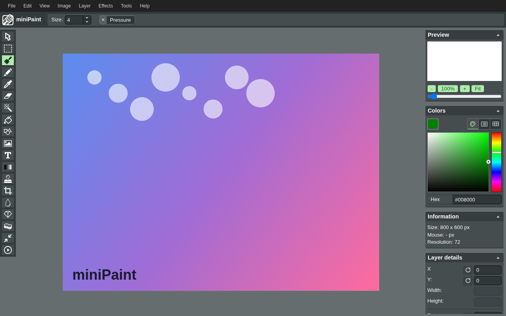

> [!IMPORTANT]
> **miniPaint is not my project.** The image editor in this repository is
> [miniPaint](https://github.com/viliusle/miniPaint) by [ViliusL](https://github.com/viliusle),
> MIT-licensed. Every tool, every filter, every menu, every pixel of its UX is upstream work.
>
> What this repository adds is the VS Code packaging, and nothing more: a `CustomEditorProvider`
> that opens a real file from disk, hands the bytes to miniPaint, and writes the edited bytes back
> when you save. That round-trip is the whole contribution here.
>
> If this is useful to you, the credit belongs upstream — go star
> [viliusle/miniPaint](https://github.com/viliusle/miniPaint).

# miniPaint for VS Code
*npm id: `paintbox` · GitHub: [NateDogDotNet/paintbox](https://github.com/NateDogDotNet/paintbox)*

**This is [miniPaint](https://github.com/viliusle/miniPaint) packaged as a VS Code extension.** The image editor — every tool, every filter, every menu, every pixel of UX — is ViliusL's work, MIT-licensed and unchanged in spirit. What this repository adds is the *integration*: a `CustomEditorProvider` that opens a real file from disk, hands its bytes to miniPaint, captures the save event, and writes the edited bytes back. That round-trip is the missing piece for code-server users — neither Photopea's extension nor luna-paint solve it; this does.

**Why this distinction matters:** the heavy lifting (a full layered photo editor) is upstream. The thin lifting (a few hundred lines of TypeScript host code, a webview shim, three bundle text-replaces) is mine. Use the search bar; install the extension; if you love it, star [viliusle/miniPaint](https://github.com/viliusle/miniPaint).



## Why this exists

code-server users don't have great options for image editing inside the IDE:

- **Photopea extension** — ships browser-only (`browser` entry point, no `main`). Webview
  renders but saves don't write back to the filesystem. Unusable for real work.
- **luna-paint** (`tyriar.luna-paint`) — architecturally sound, but commercial license.
- **Photopea web** (photopea.com) — works great, zero IDE integration. No save-to-disk
  round-trip from within the editor.

The fix is a Node-host extension with a real `CustomEditorProvider`. Open an image, edit
it with a full-featured layered editor, hit Save — the file on the server's filesystem
updates. That's it.

miniPaint was chosen over other candidates (tui.image-editor, Filerobot, Pinta) because:
it's MIT licensed, actively maintained (v4.14.3 shipped 2026-04-20), has ~30 tools plus
layers and filters, deploys as a single-file HTML/JS bundle, and exposes a clean hook
surface for intercepting the save action.

## Architecture in one paragraph

The extension registers a `CustomEditorProvider` for common image MIME types. When VS
Code opens an image, the provider spins up a webview pointed at the bundled miniPaint
HTML. The file bytes are posted into the webview on open. When the user saves,
miniPaint's `File_save` module fires a `postMessage` back to the extension host, which
writes the result with `vscode.workspace.fs.writeFile`. Saves land on the server's
filesystem. Details and a sequence diagram are in [`docs/architecture.md`](docs/architecture.md).

## Status

**v0.1.0 — the round-trip works.** Open an image, edit it, hit Save, and the file on the
server's filesystem updates. Phases 1 through 7a of
[`docs/integration-plan.md`](docs/integration-plan.md) are done: miniPaint vendored, the
custom editor registered, bytes flowing into the webview on open, the save hook patched,
the host-side write closing the loop, Save As with cross-format conversion, and packaging.
[`CHANGELOG.md`](CHANGELOG.md) lists what landed in each phase.

Not on Open VSX yet — build the VSIX yourself (see [Build a VSIX](#build-a-vsix)) and
install it. Two image formats are deliberately out of scope; see
[Known limitations](#known-limitations).

## Development

### Prerequisites

- Node.js 18+
- VS Code or code-server

### Local dev

```bash
git clone https://github.com/NateDogDotNet/paintbox
cd paintbox
npm install
npm run compile
# Press F5 in VS Code / code-server to launch the Extension Development Host
```

### Build a VSIX

```bash
npm run package
# Produces paintbox-<version>.vsix
```

### Publish to Open VSX

```bash
# Set OVSX_PAT environment variable first
npm run publish:ovsx
```

Open VSX is the target registry (not Microsoft Marketplace) so the extension works in
any code-server installation.

## Known limitations

These are environment-imposed quirks of running miniPaint inside a VS Code webview, not bugs in paintbox itself:

- **GIF and BMP files** open with VS Code's default image preview, not paintbox. miniPaint encodes GIFs via a Web Worker that the webview's CSP blocks, and most browsers don't ship a native BMP encoder. Rather than fail at save time, paintbox no longer claims these formats; right-click → Open With → Image Preview to view them.

For everything else, file an issue: https://github.com/NateDogDotNet/paintbox/issues

## miniPaint credit

This extension is powered by **miniPaint** by ViliusL.  
Source: https://github.com/viliusle/miniPaint  
License: MIT

Icon adapted from miniPaint by ViliusL (MIT).

miniPaint is vendored at `vendor/minipaint/` (committed copy, pinned to v4.14.3). Its
license notice is preserved in [`THIRD_PARTY_LICENSES.md`](THIRD_PARTY_LICENSES.md)
and bundled inside the VSIX.

## License

MIT. See [LICENSE](LICENSE).
