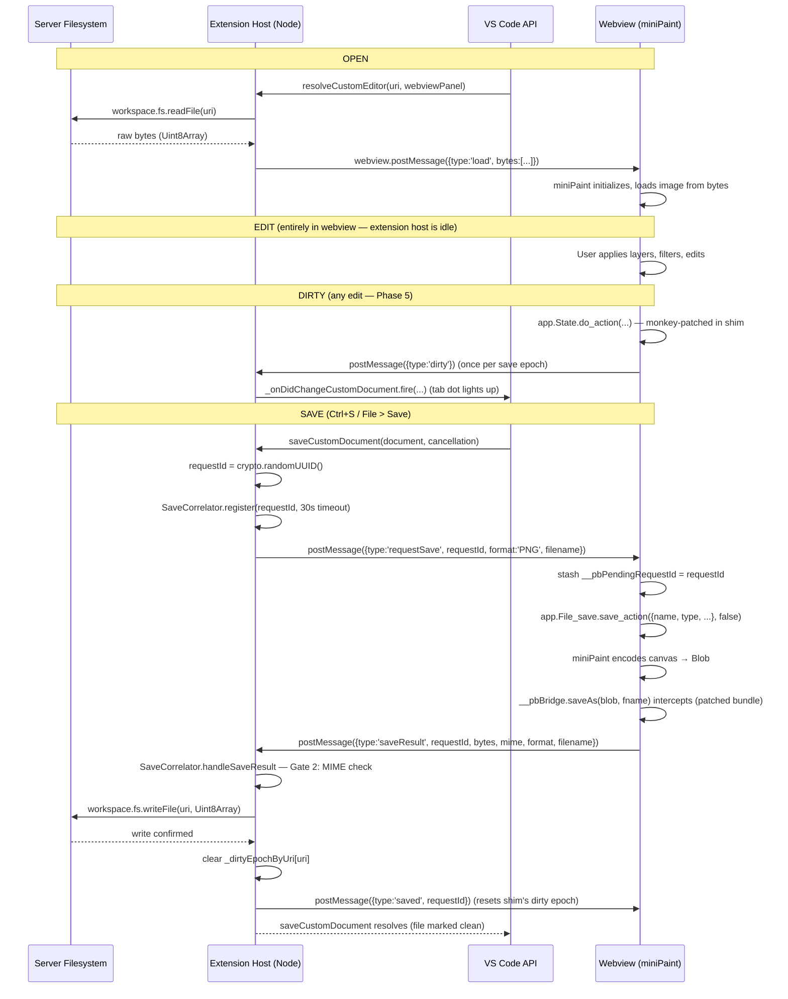

# Architecture: Paintbox VS Code Extension

## Problem Statement

VS Code / code-server's web extension host cannot write back to the server filesystem.
Extensions that ship only a `browser` entry point (e.g., the Photopea extension) can
render a webview, but any "Save" action writes to the browser's memory — not the file
on disk. For a code-server user on a remote machine, that's a dead end.

The fix: a Node-host extension with `main` (not `browser`). The Node host has full
access to `vscode.workspace.fs`, which routes writes through VS Code's filesystem layer
to the actual server disk.

## Core Pattern: CustomEditorProvider + Webview Bridge

VS Code's `CustomEditorProvider` API lets an extension take ownership of how certain
file types are opened. Instead of VS Code's default text editor, the extension renders
a webview. The webview can contain any HTML/JS — in this case, miniPaint.

The extension host and the webview communicate via `postMessage` / `onDidReceiveMessage`.
This is the only sanctioned channel between the two execution contexts. File bytes travel
over this channel in both directions.

## Sequence: Open → Edit → Save



## Component Inventory

| Component | File | Purpose |
|-----------|------|---------|
| Extension entry | `src/extension.ts` | `activate()` — registers the provider |
| Editor provider | `src/editorProvider.ts` | Implements `CustomEditorProvider<ImageDocument>` |
| Image document | `src/editorProvider.ts` (inner class) | In-memory model; holds bytes + dirty state |
| miniPaint bundle | `vendor/minipaint/` | Upstream HTML/JS (Phase 1, not yet vendored) |
| Webview HTML | built in `resolveCustomEditor` | Wraps miniPaint, adds postMessage bridge |

## Key Design Decisions

### Why `postMessage` for the save round-trip

The webview runs in a sandboxed iframe. It cannot call Node APIs directly. `postMessage`
is the only bridge. The extension host side holds a `Promise` that resolves when the
`saveResult` message arrives; `saveCustomDocument` awaits that promise.

### Why `retainContextWhenHidden: true`

miniPaint holds all layer data in its JavaScript state. If the webview is destroyed when
the tab loses focus, all unsaved layer data is lost. `retainContextWhenHidden` keeps the
webview process alive while the tab is hidden.

### Why `priority: "option"` in contributes.customEditors

`priority: "option"` means paintbox shows up as an alternative, not the default, when
opening image files. The user explicitly selects "Open With > Paintbox Image Editor."
This avoids hijacking the default image preview for every PNG in the workspace.
Change to `"default"` if you want it to take over by default.

### Why Open VSX, not Microsoft Marketplace

code-server does not have access to the Microsoft VS Code Marketplace. Open VSX
(open-vsx.org) is the open registry that code-server ships configured to use.
Publishing to Open VSX makes the extension installable directly from the Extensions
panel in any code-server instance.

### miniPaint vendoring: submodule vs copy

Decision deferred to Phase 1. Options:
- **Git submodule** — stays in sync with upstream, cleaner for tracking version bumps.
  Downside: contributors need `git submodule update --init`.
- **Committed copy** — simpler, no submodule ceremony, but version drift is manual.

Recommendation: start with a committed copy at the pinned version (v4.14.3), since
the save-hook patch modifies miniPaint's source. A submodule with a patched branch
works but adds complexity.

### miniPaint save hook surface

Phase 4 audit conclusion: `vendor/minipaint/src/js/modules/file/save.js` is
NOT loaded at runtime — `vendor/minipaint/index.html` only loads
`dist/bundle.js`, a single 1.36 MB webpack production build that already
includes a minified copy of the source. Source-only patches would be dead
text. Strategy used:

1. **Bundle text-replace (load-bearing).** At build time
   (`scripts/patch-bundle.js` → `src/patchMinipaintBundle.ts`, chained from
   `npm run compile`), `vendor/minipaint/dist/bundle.js` is read, its 8
   `p().saveAs(` call sites are rewritten to
   `((typeof window!=="undefined"&&window.__pbBridge)||p()).saveAs(`, and
   the result is written to `out/webview/minipaint-bundle.patched.js`.
   `vendor/minipaint/dist/bundle.js` itself stays byte-identical to upstream
   v4.14.3 (verifiable via `sha256sum`); the patched output ships in the
   VSIX. An integrity check throws if the call-site count is not exactly 8,
   so an upstream bump that silently changes the surface fails loud at
   build time.
2. **Source paperwork patch.** `vendor/minipaint/src/js/modules/file/save.js`
   has its `filesaver` import wrapped with a `__pbBridge`-aware shim,
   bracketed by `// PAINTBOX-PATCH-BEGIN` / `// PAINTBOX-PATCH-END` markers
   for diff visibility. NOT load-bearing at runtime, but if a future
   upstream bump triggers a full miniPaint rebuild via `npm run build`, the
   resulting bundle is already paintbox-friendly.
3. **Shim-side bridge.** `src/webview/shim.ts` installs
   `window.__pbBridge.saveAs(blob, fname)` synchronously inside its IIFE.
   The bridge marshals the blob to a byte array (`Array.from(new
   Uint8Array(buf))`) and posts `{type:'saveResult', bytes, format,
   filename, mime}` back to the host via the closure-captured `vscode`
   handle from `acquireVsCodeApi()` (single call site preserved). The
   shim `<script>` is injected immediately BEFORE the patched-bundle
   `<script>` in the webview HTML so `__pbBridge` is defined before any
   keyboard binding fires.
4. **Activation-time verification.** `activate()` calls
   `verifyPatchedBundle(extensionPath)` BEFORE registering the editor
   provider. If the artifact is missing, has the wrong header, or has the
   wrong call-site count, the activation throws — the editor is never
   registered, and the user sees "Activating extension 'paintbox' failed:
   Paintbox: patched miniPaint bundle missing or corrupt. Run `npm run
   compile` to regenerate."

`File_save_class` is a singleton with a `set_events()` initializer and a
`SAVE_TYPES` map (PNG/JPG/JSON/WEBP/GIF/BMP/TIFF, plus a commented-out
AVIF) — confirmed against v4.14.3.

---

## Design contracts

These are the load-bearing decisions the code comments cite. They were written
during the phased build-out and lived in an untracked orchestrator directory, so
the citations dangled for anyone who cloned the repo. The substance is folded in
here. Code comments refer to them by tag — `see docs/architecture.md DC-4` —
rather than by URL fragment, so `Ctrl-F DC-4` always finds the right block.

### DC-1 — The bundle is what runs; the source patch is paperwork

`vendor/minipaint/index.html` loads exactly one script, `dist/bundle.js`: a
single 1.36 MB webpack production build that has already absorbed
`src/js/modules/file/save.js`. **The source file is not loaded at runtime.**
Verified against v4.14.3:

```text
grep -c  "FileSaver"        dist/bundle.js  ->  0
grep -c  "file-saver"       dist/bundle.js  ->  0
grep -oE "saveAs\(" dist/bundle.js | wc -l  ->  8
```

The 8 minified `p().saveAs(e,n)` call sites correspond one-to-one with the 8
`filesaver.saveAs(blob, fname)` call sites in the source. Minification renames
the `filesaver` import out of existence.

The consequence is the whole patch strategy: a change to
`src/js/modules/file/save.js` that is not followed by a
`webpack --mode production` rebuild is dead text — and rebuilding needs
miniPaint's full `node_modules` plus webpack 5 plus babel, none of which
paintbox carries. So the split is:

| Layer | Role |
|---|---|
| `vendor/minipaint/dist/bundle.js` | Text-replaced at build time. **This is the load-bearing patch.** |
| `vendor/minipaint/src/js/modules/file/save.js` | Carries a matching `PAINTBOX-PATCH` marker. Not load-bearing — it exists so a future `cp -r` upstream bump plus rebuild produces a bundle that is already paintbox-friendly. |

### DC-2 — The bundle patch: build time only, 8 sites, fails loud

`src/patchMinipaintBundle.ts` (driven by `scripts/patch-bundle.js`, chained from
`npm run compile`) reads the vendored bundle, applies the replacement

```text
p().saveAs(   ->   ((typeof window!=="undefined"&&window.__pbBridge)||p()).saveAs(
```

and writes `out/webview/minipaint-bundle.patched.js` with a
`PAINTBOX-BUNDLE-PATCH` header. The VSIX ships pre-patched; activation only
*verifies* the artifact.

It asserts **exactly 8** call sites and throws otherwise. That assertion is the
upstream-bump tripwire: a miniPaint version that adds or removes a save path
fails the build loudly instead of shipping a half-patched bundle that silently
drops saves. When it fires, re-run the audit in DC-1 against the new bundle
before touching the count.

Phase 6.8 adds a second replacement in the same pass: strip the GIF and BMP
entries from miniPaint's `SAVE_TYPES` dict, so they disappear from the Save and
Export dropdowns. miniPaint encodes GIF through a Web Worker the webview CSP
blocks, and browsers ship no native BMP encoder.

### DC-3 — `window.__pbBridge` and the `acquireVsCodeApi()` singleton

VS Code throws `An instance of the VS Code API has already been retrieved.` on a
second `acquireVsCodeApi()` call, so the bridge cannot acquire its own handle.

`window.__pbBridge` is therefore a plain object created inside the shim's IIFE,
closing over the `vscode` handle the shim already holds. The patched bundle's
`(window.__pbBridge||p()).saveAs(...)` resolves to the bridge when it exists and
to miniPaint's original file-saver when it does not, which keeps the vendored
bundle usable outside the webview.

Rejected: exposing a second `window.pbVscode` global (redundant — the closure
already captures the handle); patching the bundle to *add* a registration hook
like `window.__pbRegisterSaver(fn)` (a larger patch surface than the one-token
swap); re-deriving the handle from `getState()` (that API is for state, not for
recreating the postMessage channel).

### DC-4 — Webview HTML transforms

`buildWebviewHtml` reads upstream `index.html` verbatim and applies four
transforms. Upstream markup is never forked.

1. **`<base href>` immediately after `<head>`**, pointing at
   `asWebviewUri(vendor/minipaint/)` with a trailing slash. This is the
   load-bearing one. miniPaint's CSS is compiled through webpack
   `style-loader`, which injects `<style>` tags **at runtime** carrying relative
   `url('images/icons/*.svg')` references. The host cannot see those at build
   time, so per-attribute URL rewriting and any pre-built asset manifest are
   both non-starters. A single `<base href>` resolves everything in one shot.

   Acknowledged trade-off: `<base>` affects every relative URL in the document,
   including miniPaint's one `<a href="#">` logo anchor, which some browsers
   then treat as a navigation. The shim neutralises it with a delegated click
   handler that calls `preventDefault()` on `a.logo`. `index.html` has no forms,
   and external links are absolute, so nothing else is affected.

2. **CSP `<meta>` after the `<base>`.** `default-src 'none'` with explicit
   per-directive additions — see DC-6 for the Pixabay entries.

3. **Bundle `<script>` repointed.** The patched bundle lives in `out/webview/`,
   which is outside the `<base href>` root, so the upstream
   `<script src="dist/bundle.js">` tag is rewritten to
   `asWebviewUri(out/webview/minipaint-bundle.patched.js)`.
   `localResourceRoots` already covers `out/webview/`.

4. **Shim `<script>` before `</body>`**, and before the bundle tag, so
   `window.__pbBridge` exists before any miniPaint keybinding can fire. The shim
   is a real file rather than an inline blob because `acquireVsCodeApi()` and
   the message handlers are far easier to debug that way.

The open side is deliberately asymmetric with the save side. Saving *had* to be
patched: `File_save_class` is what the File menu wires up and there is no
override point. Opening does not — `file_open_data_url_handler(data)` is public
and callable from the shim. Patching upstream where injection works is gratuitous
churn, and it keeps upstream-bump diffs limited to save-side changes.

### DC-5 — The open side uses upstream globals, not a second bundle patch

The shim originally polled `window.app.File_open`. It never resolved. Burn-in of
v0.0.2 found why: the compiled bundle never sets `window.app` — the `app`
singleton is module-private and webpack minifies it to `v.A`. What upstream
*does* expose, deliberately, is `window.FileOpen`, `window.FileSave`,
`window.State` (plus `window.Layers`, `window.AppConfig`). The old shim also had
the casing wrong: `File_open` / `File_save` against the bundle's `FileOpen` /
`FileSave`.

**The shim uses those upstream globals directly.** Rejected: injecting
`window.app = v.A;` next to the existing assignments in the bundle. That would
add a second text-replace surface, and `v.A` is a purely positional minifier
token with no stability across upstream bumps — unlike `p().saveAs(`, which is
at least semantically discoverable. Using an entry point upstream already
publishes beats inventing one.

Worth knowing why this survived so long: the Phase 3 test called
`vscode.openWith`, waited a fixed 4 s, then asserted no error had been shown —
but the shim's poll only rejects at 10 s, so the test always exited first. A
false pass. The Phase 4–6 tests use a fake webview that synthesises `saveResult`
directly and never exercise the bundle at all.

### DC-6 — Unsolicited saves, Print, and the Pixabay CSP relaxation

miniPaint's own UI can initiate a save the host never asked for (Export, in-app
Save As, Print). The provider's `saveResult` handler branches three ways:

- **requestId matches a pending host save** — the correlator resolves it (DC-7).
- **requestId is the `__print__` sentinel** — the shim monkey-patches
  `window.print` before the bundle loads, stashes that sentinel, and drives
  `FileSave.save_action`. The host writes the bytes to a temp PNG and calls
  `env.openExternal`. Webviews cannot reach a real OS print dialog, and an
  in-webview print preview is a large scope for little gain. On code-server the
  viewer may not exist, so a failed `openExternal` falls back to a toast naming
  the temp path.
- **anything else — an unsolicited in-app save** — the host opens
  `showSaveDialog`, defaulting to the open document's parent directory and
  miniPaint's suggested filename, and writes the bytes there. Cancelling is a
  silent no-op. These exports do **not** touch the open document's dirty state;
  Ctrl+S afterwards still saves the in-place file. No new map is needed to know
  which document the save belongs to — `document.uri` is already captured in the
  message-handler closure.

Search Images needs `connect-src https://pixabay.com` and
`img-src https://pixabay.com https://*.pixabay.com`, added per-directive so
`default-src 'none'` stands. Proxying Pixabay through the extension host was
rejected: no real security gain (miniPaint's API key is already public in its
`config.js`) in exchange for re-implementing pagination and error handling.

### DC-7 — `requestId` correlation

Without a correlation token, an unsolicited Ctrl+S inside the webview can
resolve a host-initiated save's promise with the wrong bytes. Concurrent saves
are possible too — auto-save firing during an explicit save, or two documents
saving at once.

Every host-initiated save carries a `crypto.randomUUID()`. A monotonic counter
was rejected: it does not survive an extension restart, so a stale `saveResult`
arriving after a reload could match a fresh request. UUIDs cannot collide across
restarts, and `crypto` is stdlib — the safer option is also the smaller one.

`src/saveCorrelator.ts` holds the map, the timeouts, and the cancel-by-predicate
path, deliberately free of any `vscode` import so it can be unit-tested without
launching an editor.

### DC-8 — Backup re-exports; it does not cache bytes

`backupCustomDocument` triggers a fresh export through the same round-trip and
writes to `context.destination`, rather than replaying the last successful
`saveResult`. A backup built from stale bytes is worse than no backup: it looks
like recovery while silently discarding everything the user did after the last
save.

The cost is that backup runs during VS Code shutdown, where the budget is a few
seconds. Mitigations: the same 30 s timeout as a normal save, so an unresponsive
webview fails loudly instead of truncating the file mid-write, and VS Code's
cancellation token is honoured when its shutdown budget expires.

### DC-9 — Dirty tracking hooks `State.do_action`

The dirty dot is driven by a shim monkey-patch on miniPaint's
`State.do_action`, gated to fire once per save epoch. That method is miniPaint's
central command dispatch — every undoable edit from every tool, filter, and
layer operation goes through it — so it is the highest-fidelity signal available
without touching upstream source.

Rejected: treating any pointer event as an edit (miniPaint's side panel emits
hover events, so merely inspecting an image would mark it dirty); always-dirty
(passes the "dot clears after save" test but fails the obvious UX expectation);
polling a periodic re-encode to diff the canvas (the most expensive imaginable
way to detect a click).

### DC-10 — Format / MIME validation gates

The five MIMEs declared in `contributes.customEditors[].selector` are the only
formats allowed to reach `vscode.workspace.fs.writeFile`. `.tiff`, `.avif`,
`.svg`, and miniPaint's native `.json` layer format must never be written by the
host. Three gates enforce that, in order:

- **Gate 1 — pre-flight, in `_writeViaWebview`.** Derive the format from the
  destination extension via `FORMAT_BY_EXT`. Unknown extension throws before any
  webview round-trip happens, which is what catches an unsupported path chosen in
  a Save As dialog.
- **Gate 2 — post-flight, on `saveResult`.** Compare the arriving `mime` against
  the `expectedMime` recorded with the pending request. A mismatch rejects the
  save rather than writing the wrong format to disk. This should not be reachable
  in normal operation; it exists because the shim can in principle be bypassed.
- **Gate 3 — surfacing.** Both gates throw with a user-readable message, which
  VS Code renders as `Save failed: …`, and log full context to the host console.

A save the user starts *inside* the webview in an unsupported format arrives with
no matching `requestId`, so it takes the unsolicited path in DC-6 and never
writes in place. That is the ghost-write prevention: nothing silently lands on
disk in a format the editor did not declare.

### DC-11 — Every post after an `await` goes through `_postIfAlive`

`WebviewPanel.webview` is a **getter that throws** `Webview is disposed` once VS
Code tears the panel down. The throw is synchronous, so the usual
`postMessage(...).then(undefined, noop)` guard never sees it — the exception
escapes before there is a promise to attach a handler to.

That matters because the provider looks a panel up in `_webviewByUri` and then
awaits: a disk read, a correlator round-trip. The editor can close during that
await. VS Code still delivers `$revert` and `$backup` for the document,
`onDidDispose` has already run or is about to, and the panel handle in hand is
dead.

So the rule is: **a bare `panel.webview.postMessage(...)` is only safe before the
first `await` in a method.** Everything after one goes through
`_postIfAlive(panel, message)`, which swallows both the synchronous getter throw
and a mid-flight rejection, and returns `false` when the panel was gone. Callers
use that to tell "the editor closed" apart from a real failure — a closed editor
needs no load message and no `saved` ping, and neither is worth a toast.

Covered by test `5g`, which replaces the panel's `webview` with a throwing
getter and asserts revert both resolves and stays silent.

### Test strategy

Three suites in `src/test/suite/`, run by `npm test` through
`@vscode/test-electron`:

- **`correlator.test.ts`** — pure unit tests of `SaveCorrelator`. No `vscode`
  import, which is the reason the correlator was extracted from the provider.
- **`extension.test.ts`** — activation and the open path.
- **`save.test.ts`** — the save round-trip, Save As and cross-format conversion,
  and the Phase 6.6 unsolicited-save, Print, and Export paths.

The save-side suites drive a fake webview that synthesises `saveResult`
directly. That keeps them fast and hermetic, and it means **they do not exercise
the real miniPaint bundle** — the gap that hid the bug in DC-5. Treat a green
suite as evidence about the host, not about the webview.
