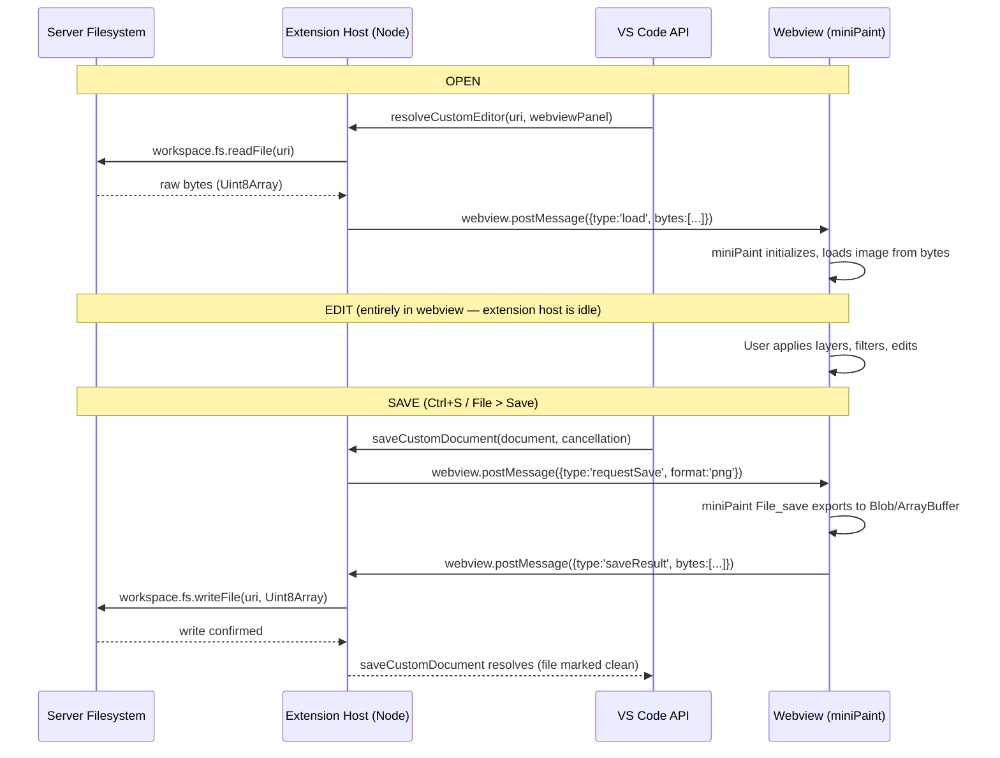

# Architecture: Paintbox VS Code Extension

## Problem Statement

VS Code / code-server's web extension host cannot write back to the server filesystem.
Extensions that ship only a `browser` entry point (e.g., the Photopea extension) can
render a webview, but any "Save" action writes to the browser's memory — not the file
on disk. For a code-server user on a remote machine, that's a dead end.

The fix: a Node-host extension with `main` (not `browser`). The Node host has full
access to `vscode.workspace.fs`, which routes writes through VS Code's filesystem layer
to the actual server disk.

## Core Pattern: CustomEditorProvider + Webview Bridge

VS Code's `CustomEditorProvider` API lets an extension take ownership of how certain
file types are opened. Instead of VS Code's default text editor, the extension renders
a webview. The webview can contain any HTML/JS — in this case, miniPaint.

The extension host and the webview communicate via `postMessage` / `onDidReceiveMessage`.
This is the only sanctioned channel between the two execution contexts. File bytes travel
over this channel in both directions.

## Sequence: Open → Edit → Save

## Component Inventory

| Component | File | Purpose |
|-----------|------|---------|
| Extension entry | `src/extension.ts` | `activate()` — registers the provider |
| Editor provider | `src/editorProvider.ts` | Implements `CustomEditorProvider<ImageDocument>` |
| Image document | `src/editorProvider.ts` (inner class) | In-memory model; holds bytes + dirty state |
| miniPaint bundle | `vendor/minipaint/` | Upstream HTML/JS (Phase 1, not yet vendored) |
| Webview HTML | built in `resolveCustomEditor` | Wraps miniPaint, adds postMessage bridge |

## Key Design Decisions

### Why `postMessage` for the save round-trip

The webview runs in a sandboxed iframe. It cannot call Node APIs directly. `postMessage`
is the only bridge. The extension host side holds a `Promise` that resolves when the
`saveResult` message arrives; `saveCustomDocument` awaits that promise.

### Why `retainContextWhenHidden: true`

miniPaint holds all layer data in its JavaScript state. If the webview is destroyed when
the tab loses focus, all unsaved layer data is lost. `retainContextWhenHidden` keeps the
webview process alive while the tab is hidden.

### Why `priority: "option"` in contributes.customEditors

`priority: "option"` means paintbox shows up as an alternative, not the default, when
opening image files. The user explicitly selects "Open With > Paintbox Image Editor."
This avoids hijacking the default image preview for every PNG in the workspace.
Change to `"default"` if you want it to take over by default.

### Why Open VSX, not Microsoft Marketplace

code-server does not have access to the Microsoft VS Code Marketplace. Open VSX
(open-vsx.org) is the open registry that code-server ships configured to use.
Publishing to Open VSX makes the extension installable directly from the Extensions
panel in any code-server instance.

### miniPaint vendoring: submodule vs copy

Decision deferred to Phase 1. Options:
- **Git submodule** — stays in sync with upstream, cleaner for tracking version bumps.
  Downside: contributors need `git submodule update --init`.
- **Committed copy** — simpler, no submodule ceremony, but version drift is manual.

Recommendation: start with a committed copy at the pinned version (v4.14.3), since
the save-hook patch modifies miniPaint's source. A submodule with a patched branch
works but adds complexity.

### miniPaint save hook surface

Phase 4 audit conclusion: `vendor/minipaint/src/js/modules/file/save.js` is
NOT loaded at runtime — `vendor/minipaint/index.html` only loads
`dist/bundle.js`, a single 1.36 MB webpack production build that already
includes a minified copy of the source. Source-only patches would be dead
text. Strategy used:

1. **Bundle text-replace (load-bearing).** At build time
   (`scripts/patch-bundle.js` → `src/patchMinipaintBundle.ts`, chained from
   `npm run compile`), `vendor/minipaint/dist/bundle.js` is read, its 8
   `p().saveAs(` call sites are rewritten to
   `((typeof window!=="undefined"&&window.__pbBridge)||p()).saveAs(`, and
   the result is written to `out/webview/minipaint-bundle.patched.js`.
   `vendor/minipaint/dist/bundle.js` itself stays byte-identical to upstream
   v4.14.3 (verifiable via `sha256sum`); the patched output ships in the
   VSIX. An integrity check throws if the call-site count is not exactly 8,
   so an upstream bump that silently changes the surface fails loud at
   build time.
2. **Source paperwork patch.** `vendor/minipaint/src/js/modules/file/save.js`
   has its `filesaver` import wrapped with a `__pbBridge`-aware shim,
   bracketed by `// PAINTBOX-PATCH-BEGIN` / `// PAINTBOX-PATCH-END` markers
   for diff visibility. NOT load-bearing at runtime, but if a future
   upstream bump triggers a full miniPaint rebuild via `npm run build`, the
   resulting bundle is already paintbox-friendly.
3. **Shim-side bridge.** `src/webview/shim.ts` installs
   `window.__pbBridge.saveAs(blob, fname)` synchronously inside its IIFE.
   The bridge marshals the blob to a byte array (`Array.from(new
   Uint8Array(buf))`) and posts `{type:'saveResult', bytes, format,
   filename, mime}` back to the host via the closure-captured `vscode`
   handle from `acquireVsCodeApi()` (single call site preserved). The
   shim `<script>` is injected immediately BEFORE the patched-bundle
   `<script>` in the webview HTML so `__pbBridge` is defined before any
   keyboard binding fires.
4. **Activation-time verification.** `activate()` calls
   `verifyPatchedBundle(extensionPath)` BEFORE registering the editor
   provider. If the artifact is missing, has the wrong header, or has the
   wrong call-site count, the activation throws — the editor is never
   registered, and the user sees "Activating extension 'paintbox' failed:
   Paintbox: patched miniPaint bundle missing or corrupt. Run `npm run
   compile` to regenerate."

`File_save_class` is a singleton with a `set_events()` initializer and a
`SAVE_TYPES` map (PNG/JPG/JSON/WEBP/GIF/BMP/TIFF, plus a commented-out
AVIF) — confirmed against v4.14.3.
